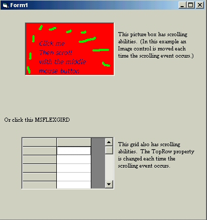



## Mouse scrolling

### Description

Vb's textbox will scroll up/down when you scroll with the mouse wheel, so will combo boxes. For those controls that cannot do this you need to add this functionality manually.        The zip file includes a module for just this purpose and an example form (see screenshot) to show how to use it.     The module recieves the mousescrolling event and then calls the mousemove event of the corresponding control. The code in the mousemove event sub must then check the module to see whether scrolling has indeed taken place, and if so in what direction. It can then respond by changing the .Top property or .TopRow property.    This is particularly useful for MSFLEXGRID.
 
### More Info
 

             |
---                |---
**Submitted On**   |2005-09-25 11:30:10
**By**             |[Adlib Logic](https://github.com/Planet-Source-Code/PSCIndex/blob/master/ByAuthor/adlib-logic.md)
**Level**          |Intermediate
**User Rating**    |4.9 (49 globes from 10 users)
**Compatibility**  |VB 6\.0
**Category**       |[VB function enhancement](https://github.com/Planet-Source-Code/PSCIndex/blob/master/ByCategory/vb-function-enhancement__1-25.md)
**World**          |[Visual Basic](https://github.com/Planet-Source-Code/PSCIndex/blob/master/ByWorld/visual-basic.md)
**Archive File**   |[Mouse\_scro1935359252005\.zip](https://github.com/Planet-Source-Code/adlib-logic-mouse-scrolling__1-62681/archive/master.zip)

